## BEAR-A Query Evaluation results
{:#appendix-bear-a}

In this appendix section, we list all measured BEAR-A query evaluation durations.
Each figure contains the durations for each storage approach, being
OSTRICH, HDT-IC, HDT-CB, Jena-IC, Jena-CB, Jena-TB and Jena-CB/TB.
The raw results that were used to generate these figures can be found at TODO.

{:.todo}
link to raw results.

<figure id="result_beara-vm-s-low">
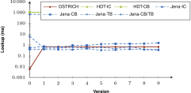
<figcaption markdown="block">
Average VM query results for S?? triple patterns with a low cardinality.
</figcaption>
</figure>

<figure id="result_beara-vm-s-high">
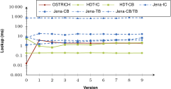
<figcaption markdown="block">
Average VM query results for S?? triple patterns with a high cardinality.
</figcaption>
</figure>

<figure id="result_beara-vm-p-low">
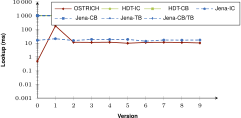
<figcaption markdown="block">
Average VM query results for ?P? triple patterns with a low cardinality.
</figcaption>
</figure>

<figure id="result_beara-vm-p-high">
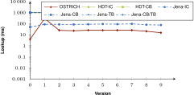
<figcaption markdown="block">
Average VM query results for ?P? triple patterns with a high cardinality.
</figcaption>
</figure>

<figure id="result_beara-vm-o-low">
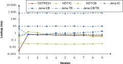
<figcaption markdown="block">
Average VM query results for ??O triple patterns with a low cardinality.
</figcaption>
</figure>

<figure id="result_beara-vm-o-high">
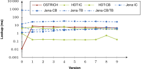
<figcaption markdown="block">
Average VM query results for ??O triple patterns with a high cardinality.
</figcaption>
</figure>

<figure id="result_beara-vm-sp-low">

<figcaption markdown="block">
Average VM query results for SP? triple patterns with a low cardinality.
</figcaption>
</figure>

<figure id="result_beara-vm-sp-high">
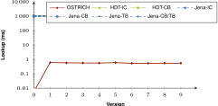
<figcaption markdown="block">
Average VM query results for SP? triple patterns with a high cardinality.
</figcaption>
</figure>

<figure id="result_beara-vm-so-low">
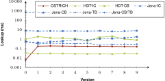
<figcaption markdown="block">
Average VM query results for S?O triple patterns with a low cardinality.
</figcaption>
</figure>

<figure id="result_beara-vm-po-low">
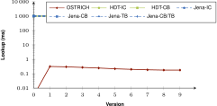
<figcaption markdown="block">
Average VM query results for ?PO triple patterns with a low cardinality.
</figcaption>
</figure>

<figure id="result_beara-vm-po-high">
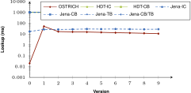
<figcaption markdown="block">
Average VM query results for ?PO triple patterns with a high cardinality.
</figcaption>
</figure>

<figure id="result_beara-vm-spo">
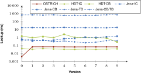
<figcaption markdown="block">
Average VM query results for SPO triple patterns.
</figcaption>
</figure>