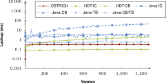
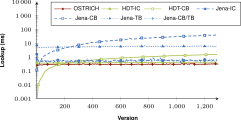

## BEAR-B-hourly Query Evaluation results
{:#appendix-bear-b-hourly}

In this appendix section, we list all measured BEAR-B-hourly query evaluation durations.
Each figure contains the durations for each storage approach, being
OSTRICH, HDT-IC, HDT-CB, Jena-IC, Jena-CB, Jena-TB and Jena-CB/TB.

<figure id="result_bearb-hourly-vm-p">

<figcaption markdown="block">
Average VM query results for ?P? triple patterns for all versions.
</figcaption>
</figure>

<figure id="result_bearb-hourly-vm-po">

<figcaption markdown="block">
Average VM query results for ?PO triple patterns for all versions.
</figcaption>
</figure>

<figure id="result_bearb-hourly-dm-p">

<figcaption markdown="block">
Average DM query results for ?P? triple patterns from version 0 to all other versions.
</figcaption>
</figure>

<figure id="result_bearb-hourly-dm-po">

<figcaption markdown="block">
Average DM query results for ?PO triple patterns from version 0 to all other versions.
</figcaption>
</figure>

<figure id="result_bearb-hourly-vq-p">

<figcaption markdown="block">
Average VQ query results for ?P? triple patterns.
</figcaption>
</figure>

<figure id="result_bearb-hourly-vq-po">

<figcaption markdown="block">
Average VQ query results for ?PO triple patterns.
</figcaption>
</figure>