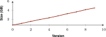
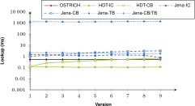

## Evaluation
{:#evaluation}

In this section, we evaluate our proposed storage technique and querying algorithms.
We start by introducing OSTRICH, an implementation of our proposed solution.
After that, we describe the setup of our experiments, followed by presenting our results.
Finally, we discuss these results.

### Implementation
{:#implementation}

OSTRICH stands for _Offset-enabled STore for TRIple CHangesets_,
and it is a software implementation of the storage and querying techniques described in this article
It is implemented in C/C++ and available on [GitHub](https://zenodo.org/record/883008){:.mandatory} under an open license.
In the scope of this work, OSTRICH currently supports a single snapshot and delta chain.
OSTRICH uses [HDT](cite:cites hdt) as snapshot technology as it conforms to all the [requirements](#snapshot-storage) for our approach.
Furthermore, for our indexes we use [Kyoto Cabinet](http://fallabs.com/kyotocabinet/){:.mandatory},
which provides a highly efficient memory-mapped B+Tree implementation with compression support.
OSTRICH immediately generates the main `SPO` index and the auxiliary `OSP` and `POS` indexes.
In future work, OSTRICH could be modified to only generate the main index and delay auxiliary index generation to a later stage.
Memory-mapping is required so that not all data must be loaded in-memory when queries are evaluated,
which would not always be possible for large datasets.
For our delta dictionary, we extend HDT's dictionary implementation with adjustments to make it work with unsorted triple components.
We compress this delta dictionary with [gzip](http://www.gzip.org/), which requires decompression during querying and ingestion.
Finally, for storing our addition counts, we use the Hash Database of Kyoto Cabinet, which is also memory-mapped.

We provide a developer-friendly C/C++ API for ingesting and querying data based on an OSTRICH store.
Additionally, we provide command-line tools for ingesting data into an OSTRICH store,
or evaluating VM, DM or VQ triple pattern queries for any given limit and offset against a store.
Furthermore, we implemented [Node JavaScript bindings](https://zenodo.org/record/883010){:.mandatory} that
expose the OSTRICH API for ingesting and querying to JavaScript applications.
We used these bindings to [expose an OSTRICH store](http://versioned.linkeddatafragments.org/bear){:.mandatory}
containing a dataset with 30M triples in 10 versions using [TPF](cite:cites ldf), with the [VTPF feature](cite:cites vtpf).

### Experimental Setup

As mentioned before in , we evaluate our approach using the BEAR benchmark.
We extended the existing BEAR implementation for the evaluation of offsets.
We did this by implementing custom offset features into each of the BEAR approaches.
Only for VM queries in HDT-IC an efficient implementation (HDT-IC+) could be made because of HDT's native offset capabilities.
In all other cases, naive offsets had to be implemented by iterating over the result stream
until a number of elements equal to the desired offset were consumed.
This modified implementation is available on [GitHub](https://github.com/rdfostrich/bear/tree/ostrich-eval-journal){:.mandatory}.
To test the scalability of our approach for datasets with few and large versions, we use the BEAR-A benchmark.
We use the ten first versions of the BEAR-A dataset, which contains an average of 17M triples per version.
This dataset was compiled from the [Dynamic Linked Data Observatory](http://swse.deri.org/dyldo/).
To test for datasets with many smaller versions, we use BEAR-B with the daily and hourly granularities.
The daily dataset contains 89 versions and the hourly dataset contains 1,299 versions,
both of them have around 48K triples per version.
We did not evaluate BEAR-B-instant, because OSTRICH requires increasingly
more time for each new version ingestion, as will be shown in the next section.
As BEAR-B-hourly with 1,299 versions already takes more than three days to ingest,
the 21,046 versions from BEAR-B-instant would require too much time to ingest.
Our experiments were executed on a 64-bit
Ubuntu 14.04 machine with 128 GB of memory and a
24-core 2.40 GHz CPU.

For BEAR-A, we use all 7 of the provided querysets, each containing at most 50 triple pattern queries,
once with a high result cardinality and once with a low result cardinality.
These querysets correspond to all possible triple pattern materializations, except for triple patterns where each component is blank.
For BEAR-B, only two querysets are provided, those that correspond to `?P?` and `?PO` queries.
The number of BEAR-B queries is more limited, but they are derived from real-world DBpedia queries
which makes them useful for testing real-world applicability.
All of these queries can be evaluated as VM queries on all versions,
as DM between the first version and all other versions,
and as VQ.

For a complete comparison with other approaches, we re-evaluated BEAR's Jena and HDT-based RDF archive implementations.
More specifically, we ran all BEAR-A queries against Jena with the IC, CB, TB and hybrid CB/TB implementation,
and HDT with the IC and CB implementations
using the BEAR-A dataset for ten versions.
We did the same for BEAR-B with the daily and hourly dataset.
After that, we evaluated OSTRICH for the same queries and datasets.

Additionally, we evaluated the ingestion rates and storage sizes for all approaches.
Furthermore, we compared the ingestion rate for the two different ingestion algorithms of OSTRICH.
The batch-based algorithm ran out of memory for larger amounts of versions,
so we used the streaming-based algorithm for all further evaluations.

Finally, we evaluated the offset capabilities of OSTRICH
by comparing it with custom offset implementations for the other approaches.
We evaluated the blank triple pattern query with offsets ranging from 2 to 4,096 with a limit of 10 results.

### Results

In this section, we present the results of our evaluation.
We report the ingestion results, query evaluation times for all cases and offset result.
All raw results and the scripts that were used to process them are available on [GitHub](https://github.com/rdfostrich/ostrich-bear-results/){:.mandatory}.

#### Ingestion

Tables [4](#results-ingestion-time) and [5](#results-ingestion-size)
respectively show the ingestion times and storage requirements for the different approaches for the three different benchmarks.
OSTRICH-reduced shows the results without the auxiliary `OSP` and `POS` indexes.
These results have been derived from the ingestion into a regular OSTRICH store,
so ingestion time is not explicitly measured, only storage size.
For BEAR-A, the HDT-based approaches outperform OSTRICH in terms of ingestion time, they are about two orders of magniture faster.
Only HDT-CB requires slightly less storage space.
The Jena-based approaches ingest one order of magnitude faster than OSTRICH, but require more storage space.
For BEAR-B-daily, OSTRICH requires less storage space than all other approaches except for HDT-CB at the cost of slower ingestion.
For BEAR-B-hourly, only HDT-CB and Jena-CB/TB require about 8 to 4 times less space than OSTRICH.

<figure id="results-ingestion-time" class="table" markdown="1">

| Approach        | BEAR-A | BEAR-B-daily  | BEAR-B-hourly |
| --------------- |-------:|--------------:|--------------:|
| OSTRICH         | 2,256  | 12.36         | 4,497.32      |
| Jena-IC         |   443  |  8.91         |  142.26       |
| Jena-CB         |   226  |  9.53         |  173.48       |
| Jena-TB         | 1,746  |  0.35         |   70.56       |
| Jena-CB/TB      |   679  |  0.35         |    0.65       |
| HDT-IC          |    34  |  0.39         |    5.89       |
| HDT-CB          |   *18* | *0.02*        |   *0.07*      |

<figcaption markdown="block">
Ingestion times for each of the RDF archive approaches with BEAR-A, BEAR-B-daily and BEAR-B-hourly.
The lowest times per dataset are indicated in italics.
</figcaption>
</figure>

<figure id="results-ingestion-size" class="table" markdown="1">

| Approach        | BEAR-A               | BEAR-B-daily   | BEAR-B-hourly      |
| --------------- |---------------------:|---------------:|-------------------:|
| Raw (N-Triples) | 46,069.76            | 556.44         | 8,314.86           |
| Raw (gzip)      |  3,194.88            |  30.98         |   466.35           |
| OSTRICH         |  3,102.72 (+1,484.8) |  12.32 (+4.55) |   187.46 (+263.13) |
| Jena-IC         | 32,808.96            | 415.32         | 6,233.92           |
| Jena-CB         | 18,216.96            |  42.82         |   473.41           |
| Jena-TB         | 82,278.4             |  23.61         | 3,678.89           |
| Jena-CB/TB      | 31,160.32            |  22.83         |    53.84           |
| HDT-IC          |  5,335.04 (+1.46)    | 142.08 (+6.71) | 2,127.57 (+101.49) |
| HDT-CB          | *2,682.88 (+0.79)*   |  *5.96 (+0.75)*|   *24.39 (+10.29)* |

<figcaption markdown="block">
Storage sizes for each of the RDF archive approaches in MB with BEAR-A, BEAR-B-daily and BEAR-B-hourly.
The additional storage size for the auxiliary OSTRICH indexes and HDT index files are provided between brackets.
The lowest sizes per dataset are indicated in italics.
</figcaption>
</figure>

As mentioned in , we use a threshold to define which addition count values should be stored,
and which ones should be evaluated at query time.
For our experiments, we fixed this count threshold at 200,
as for values higher than 200, the addition counts started having a noticable impact on the performance of count estimation.
This threshold value means that when a triple pattern has 200 matching additions,
then this count will be stored.
 shows the storage space requirements of the addition counts.
Results show that for BEAR-A and BEAR-B-hourly, the storage space is insignificant compared to the total space requirements.
However, for BEAR-B-daily, addition counts take up 37.05% of the total size with still an acceptable absolute size,
which is simply because the addition and deletion trees require relatively less space,
because of the lower amount of versions.
Within the scope of this work, we keep using this fixed threshold of 200.
We consider investigating the impact of different threshold levels and methods for dynamically determining optimal levels future work.

<figure id="results-addition-counts" class="table" markdown="1">

| BEAR-A            | BEAR-B-daily   | BEAR-B-hourly      |
|------------------:|---------------:|-------------------:|
| 13.69 (0.29%)     | 6.25 (37.05%)  | 15.62 (3.46%)      |

<figcaption markdown="block">
Storage sizes of the OSTRICH addition count component in MB with BEAR-A, BEAR-B-daily and BEAR-B-hourly.
The percentage of storage space that this component requires compared to the complete store is indicated between brackets.
</figcaption>
</figure>

 shows the compressibility of OSTRICH datasets,
which indicates that datasets with more versions are more prone to space savings using compression techniques like gzip.
Furthermore, compressibility increases slightly when reduced OSTRICH stores are used.

<figure id="results-ostrich-compressability" class="table" markdown="1">

| Dataset       | Original Size (MB)   | gzip (MB)            | Space savings   |
| ------------- |---------------------:|---------------------:|----------------:|
| **OSTRICH**{:.hr} ||||
| BEAR-A        | 3,117.64 (+1,469.88) | 2,155.13 (+1,117.37) | 30.87% (-2.21%) |
| BEAR-B-daily  |    12.32 (+4.55)     |     3.35 (+2.07)     | 72.80% (-4.93%) |
| BEAR-B-hourly |   187.46 (+263.13)   |    34.92 (+51.2)     | 81.37% (-0.49%) |

<figcaption markdown="block">
Compressability of regular and reduced OSTRICH stores using gzip.
The additional storage size for the auxiliary OSTRICH indexes and HDT index files are provided between brackets.
The lowest sizes per dataset are indicated in italics. (TODO!!!!)
</figcaption>
</figure>

 shows the ingestion rate for each consecutive version for BEAR-A,
while  shows the corresponding increasing storage sizes.
Analogously,  shows the ingestion rate for BEAR-B-hourly,
and  shows its storage sizes.
For BEAR-A, a linear trend for both ingestion duration and storage space for each consecutive version can observed.
For BEAR-B-hourly, these slightly increase for larger versions.
Furthermore,  shows that the OSTRICH ingestion algorithm becomes slower around version 1,200,
showing a limitation of our system when only a single snapshot is used. In future work, a new snapshot could be created _before_ this point is reached.

<figure id="results-ostrich-ingestion-rate-beara">

<figcaption markdown="block">
OSTRICH ingestion durations for each consecutive BEAR-A version in minutes for an increasing number of versions,
showing a lineair growth.
</figcaption>
</figure>

<figure id="results-ostrich-ingestion-size-beara">

<figcaption markdown="block">
Cumulative OSTRICH store sizes for each consecutive BEAR-A version in GB for an increasing number of versions,
showing a lineair growth.
</figcaption>
</figure>

<figure id="results-ostrich-ingestion-rate-bearb-hourly">

<figcaption markdown="block">
OSTRICH ingestion durations for each consecutive BEAR-B-hourly version in minutes for an increasing number of versions.
</figcaption>
</figure>

<figure id="results-ostrich-ingestion-size-bearb-hourly">

<figcaption markdown="block">
Cumulative OSTRICH store sizes for each consecutive BEAR-B-hourly version in GB for an increasing number of versions.
</figcaption>
</figure>

 compares the BEAR-A ingestion rate of the streaming and batch algorithms.
While the batch algorithm is faster than the streaming algorithm for the first 9 versions,
the batch algorithm quickly becomes slower after that, and runs out of memory after version 10, even on a machine with 128 GB of memory.
The ingestion duration in case of the streaming algorithm on the other hand continues to grow linearly without memory issues.

<figure id="results-ostrich-ingestion-rate-beara-compare">

<figcaption markdown="block">
Comparison of the OSTRICH stream and batch-based ingestion durations.
The streaming algorithm starts of slower than the batch algorithm but grows linearly,
while the batch algorithm consumes a large amount of memory, resulting in slower ingestion after version 8 and an out-of-memory error after version 10.
</figcaption>
</figure>

#### Query Evaluation

Figures [9](#results-beara-vm-sumary), [10](#results-beara-dm-summary) and [11](#results-beara-vq-summary) respectively
summarize the VM, DM and VQ query durations of all BEAR-A queries on the ten first versions of the BEAR-A dataset for the different approaches.
HDT-IC clearly outperforms all other approaches in all cases,
while the Jena-based approaches are orders of magnitude slower than the HDT-based approaches and OSTRICH in all cases.
OSTRICH is about two times faster than HDT-CB for VM queries, and slightly slower for both DM and VQ queries.
For DM queries, HDT-CB does however continuously become slower for larger versions, while the lookup times for OSTRICH remain constant.
From version 7, OSTRICH is faster than HDT-CB.
[Appendix A](#appendix-bear-a) contains more detailed plots for each BEAR-A queryset,
in which we can see that all approaches collectively become slower for queries with a higher result cardinality,
and that predicate-queries are also significantly slower for all approaches.

<figure id="results-beara-vm-sumary">

<figcaption markdown="block">
Median BEAR-A VM query results for all triple patterns for all versions.
</figcaption>
</figure>

<figure id="results-beara-dm-summary">

<figcaption markdown="block">
Median BEAR-A DM query results for all triple patterns from version 0 to all other versions.
</figcaption>
</figure>

<figure id="results-beara-vq-summary">

<figcaption markdown="block">
Median BEAR-A VQ query results for all triple patterns.
</figcaption>
</figure>

Figures [12](#results-bearb-daily-vm-sumary), [13](#results-bearb-daily-dm-summary) and [14](#results-bearb-daily-vq-summary)
contain the query duration results for the BEAR-B queries on the complete BEAR-B-daily dataset for the different approaches.
Jena-based approaches are again slower than both the HDT-based ones and OSTRICH.
For VM queries, OSTRICH is slower than HDT-IC, but faster than HDT-CB, which becomes slower for larger versions.
For DM queries, OSTRICH is faster than HDT-CB for the second half of the versions, and slightly faster HDT-IC.
The difference between HDT-IC and OSTRICH is however insignificant in this case, as can be seen in [Appendix B](#appendix-bear-b-daily).
For VQ queries, OSTRICH is significantly faster than all other approaches.
[Appendix B](#appendix-bear-b-daily) contains more detailed plots for this case,
in which we can see that predicate-queries are again consistently slower for all approaches.

<figure id="results-bearb-daily-vm-sumary">

<figcaption markdown="block">
Median BEAR-B-daily VM query results for all triple patterns for all versions.
</figcaption>
</figure>

<figure id="results-bearb-daily-dm-summary">

<figcaption markdown="block">
Median BEAR-B-daily DM query results for all triple patterns from version 0 to all other versions.
</figcaption>
</figure>

<figure id="results-bearb-daily-vq-summary">

<figcaption markdown="block">
Median BEAR-B-daily VQ query results for all triple patterns.
</figcaption>
</figure>

Figures [15](#results-bearb-hourly-vm-sumary), [16](#results-bearb-hourly-dm-summary) and [17](#results-hourly-daily-vq-summary)
show the query duration results for the BEAR-B queries on the complete BEAR-B-hourly dataset for all approaches.
OSTRICH again outperforms Jena-based approaches in all cases.
HDT-IC is faster for VM queries than OSTRICH, but HDT-CB is significantly slower, except for the first 100 versions.
For DM queries, OSTRICH is comparable to HDT-IC, and faster than HDT-CB, except for the first 100 versions.
Finally, OSTRICH outperforms all HDT-based approaches for VQ queries by almost an order of magnitude.
[Appendix C](#appendix-bear-b-hourly) contains the more detailed plots
with the same conclusion as before that predicate-queries are slower.

<figure id="results-bearb-hourly-vm-sumary">

<figcaption markdown="block">
Median BEAR-B-hourly VM query results for all triple patterns for all versions.
</figcaption>
</figure>

<figure id="results-bearb-hourly-dm-summary">

<figcaption markdown="block">
Median BEAR-B-hourly DM query results for all triple patterns from version 0 to all other versions.
</figcaption>
</figure>

<figure id="results-bearb-hourly-vq-summary">

<figcaption markdown="block">
Median BEAR-B-hourly VQ query results for all triple patterns.
</figcaption>
</figure>

#### Offset

From our evaluation of offsets,  shows that OSTRICH offset evaluation remain below 1ms,
while other approaches grow beyond that for larger offsets, except for HDT-IC+.
HDT-CB, Jena-CB and Jena-CB/TB are not included in this and the following figures
because they require full materialization before offsets can be applied, which is expensive and would therefore take a very long time to evaluate.
For DM queries, all approaches have growing evaluating times for larger offsets, including OSTRICH.
Finally, OSTRICH has VQ evaluation times that are approximately independent of the offset value,
while other approaches again have growing evaluation times.

<figure id="results-offset-vm">

<figcaption markdown="block">
Median VM query results for different offsets over all versions in the BEAR-A dataset.
HDT-IC+ refers to the efficient offset implementation based on HDT's native offset capabilities.
HDT-CB, Jena-CB and Jena-CB/TB were not included due to evaluation times larger than one minute.
</figcaption>
</figure>

<figure id="results-offset-dm">

<figcaption markdown="block">
Median DM query results for different offsets between version 0 and all other versions in the BEAR-A dataset.
HDT-CB, Jena-CB and Jena-CB/TB were not included due to evaluation times larger than one minute.
</figcaption>
</figure>

<figure id="results-offset-vq">

<figcaption markdown="block">
Median VQ query results for different offsets in the BEAR-A dataset.
HDT-CB, Jena-CB and Jena-CB/TB were not included due to evaluation times larger than one minute.
</figcaption>
</figure>

### Discussion

In this section, we interpret and discuss the results from previous section.
We discuss the ingestion, query evaluation, offset efficiency and test our hypotheses.

#### Ingestion
For all evaluated cases, OSTRICH requires more effort for ingesting new data than the other approaches.
Furthermore, for each additional version in a dataset, the ingestion time increases.
This is a direct consequence of our alternative delta chain method where all deltas are relative to a snapshot.
That is the reason why when new deltas are inserted,
the previous one must be fully materialized by iterating over all existing triples,
because no version index exists.
These results should however be interpreted correctly,
because all other approaches receive their input data in the appropriate format (IC, CB, TB, CB/TB),
while OSTRICH does not.
OSTRICH must convert CB input at runtime to the alternative CB structure where deltas are relative to the snapshot,
which explains the larger ingestion times.
While CB is a typical format for exchanging versioned datasets,
in order to get a better understanding of the ingestion efficiency of OSTRICH,
we could measure conversion from CB to the alternative CB format separately,
and measure the ingestion of this alternative format afterwards in future work.
Another future optimization could be to maintain the last version of each chain in a separate index for faster patching.
Or a new ingestion algorithm could be implemented that accepts input in the correct alternative CB format.
Alternatively, a new snapshot could dynamically be created when ingestion time becomes too large.

In , we can observe large fluctuations in ingestion time around version 1,200 of BEAR-B-hourly.
This is caused by the large amount of versions that are stored for each tree value.
Since each version requires a mapping to seven triple pattern indexes and one local change flag in the deletion tree,
value sizes become non-negligible for large amounts of versions.
Each version value requires 28 uncompressed bytes,
which results in more than 32KB for a triple in 1,200 versions.
At that point, the values start to form a bottleneck as only 1,024 elements
can be loaded in-memory using the default page cache size of 32MB,
which causes a large amount of swapping.
This could be solved by either tweaking the B+Tree parameters for this large amount of versions,
reducing storage requirements for each value,
or by dynamically creating a new snapshot.

OSTRICH ingests slower than the other approaches
and achieves smaller resulting storage size in most cases.
OSTRICH achieves a smaller store than all Jena approaches for BEAR-A,
and is also slightly smaller than HDT-IC (1,49 times).
For BEAR-B-daily, OSTRICH is 8,82 times smaller than HDT-IC, and it is 4,95 times smaller for BEAR-B-hourly.
The CB and CB/TB approaches in most cases outperform OSTRICH in terms of storage space efficiency due
to the additional metadata that OSTRICH stores per triple.
For BEAR-B-daily and BEAR-B-hourly, OSTRICH even requires less storage space than gzip on raw N-Triples.

OSTRICH requires more space than gzip for BEAR-A on raw N-Triples,
but it is able to provide an efficient query interface, which gzip is not.
For the BEAR-B cases, OSTRICH requires less storage space than gzip.
If pure compression is required without querying capabilities,
OSTRICH's format is still beneficial as is shown in  and .
For the BEAR-B cases, OSTRICH requires less storage space more than gzip,
which is because of the increased redundancy in B+Tree values.
Furthermore, compressing BEAR-B-hourly saves even more space (80.88%) than BEAR-B-daily (67.87%),
because of the same reason, BEAR-B-hourly contains 1,299 versions, while BEAR-B-daily contains 89 versions.
For reduced OSTRICH stores, where only the main `SPO` index is stored,
this compressibility rate is even slightly higher.

We compared the streaming and batch-based ingestion algorithm in .
The streaming algorithm has linearly increasing durations for each next version,
while the batch algorithm is significantly faster for the first seven versions,
it quickly becomes slower after that. After version 10 it runs out of memory.
The batch algorithm is faster because most operations can happen in memory,
while the streaming algorithm only uses a small fraction of that memory,
which makes the latter usable for very large datasets that don't fit in memory.
In future work, a hybrid between the current streaming and batch algorithm could be investigated,
i.e., a streaming algorithm with a larger buffer size, which is faster, but doesn't require unbounded amounts of memory.

#### Query Evaluation

The results from previous section show that the OSTRICH query evaluation efficiency is faster than all Jena-based approaches,
mostly faster than HDT-CB, and mostly slower than HDT-IC.
VM queries in OSTRICH are always slower than HDT-IC,
because HDT can very efficiently query a single materialized snapshot in this case,
while OSTRICH requires more operations for materializing.
VM queries in OSTRICH are however always faster than HDT-CB, because the latter has to reconstruct complete delta chains,
while OSTRICH only has to reconstruct a single delta relative to the snapshot.
For DM queries, OSTRICH is slower or comparable to HDT-IC, slower than HDT-CB for early versions, but faster for later versions.
This slowing down of HDT-CB for DM queries is again caused by reconstruction of delta chains.
For VQ queries, OSTRICH outperforms all other approaches for datasets with larger amounts of versions.
For BEAR-A, which contains only 10 versions in our case,
the HDT-based approaches are slightly faster because only a small amount of versions need to be iterated.

#### Offsets

One of our initial requirements was to design a system that allows efficient offsetting of VM, DM and VQ result streams.
As shown in last section, for both VM and VQ queries, the lookup times for various offsets remain approximately constant.
For VM queries, this can fluctuate slightly for certain offsets due to the loop section inside the VM algorithm
for determining the starting position inside the snapshot and deletion tree.
For DM queries, we do however observe an increase in lookup times for larger offsets.
That is because the current DM algorithm naively offsets these streams by iterating
over the stream until a number of elements equal to the desired offset have been consumed.
Furthermore, other IC and TB approaches outperform OSTRICH's DM result stream offsetting.
This introduces a new point of improvement for future work,
seeing whether or not OSTRICH would allow more efficient DM offsets by adjusting either the algorithm or the storage format.

#### Hypotheses

In , we introduced six hypotheses, which we will validate in this section based on our experimental results.
We will only consider the comparison between OSTRICH and HDT-based approaches,
as OSTRICH outperforms the Jena-based approaches for all cases in terms of lookup times.
These validations were done using R, for which the source code can be found on [GitHub](https://github.com/rdfostrich/ostrich-bear-results/){:.mandatory}.

For our [first hypothesis](#hypothesis-qualitative-querying), we expect OSTRICH lookup times remain independent of version for VM and DM queries.
We validate this hypothesis by building a linear regression model with as response the lookup time,
and as factors version and number of results.
 contains the influence of each factor, which shows that for all cases,
we can accept the null hypothesis that the version factor has no influence on the models with a confidence of 99%.
Based on these results, we *accept* our [first hypothesis](#hypothesis-qualitative-querying).

<figure id="hypo-test-1" class="table" markdown="1">

| Dataset       | Query      | Version (p)     | Results (p)     |
| ------------- |:-----------|:----------------|-----------------|
| BEAR-A        | VM         | **0.960**       | **0.570**       |
| BEAR-A        | DM         | **0.301**       | **0.320**       |
| BEAR-B-daily  | VM         | **0.694**       | **0.697**       |
| BEAR-B-daily  | DM         | **0.0391**      |   2.13e-09      |
| BEAR-B-hourly | VM         | **0.568319**    |   0.000574      |
| BEAR-B-hourly | DM         | **0.259**       |   2e-16         |

<figcaption markdown="block">
P-values for the linear regression model factors with the lookup time as response,
and version and number of results as factors for each of the three benchmarks for VM and DM queries.
For all cases, the version factor has no significant influence on the models,
the number of results has an influence in the last three cases.
</figcaption>
</figure>

[Hypothesis 2](#hypothesis-qualitative-ic-storage) states that OSTRICH requires *less* storage space than IC-based approaches,
and [Hypothesis 3](#hypothesis-qualitative-ic-querying) correspondingly states that
query evaluation is *slower* for VM and *faster* or *equal* for DM and VQ.
Results from previous section showed that for BEAR-A, BEAR-B-daily and BEAR-B-hourly,
OSTRICH requires *less* space than HDT-IC, which means that we *accept* Hypothesis 2.
In order to validate that query evaluation is slower for VM but faster or equal for DM and VQ,
we compared the means using the two-sample t-test, for which the results can be found in .
In all cases, the means are not equal with a confidence of 95%.
For BEAR-B-daily and BEAR-B-hourly, HDT-IC is faster for VM queries, but slower for DM and VQ queries.
For BEAR-A, HDT-IC is faster for all query types.
We therefore *reject* Hypothesis 3, as it does not apply for BEAR-A, but it is valid for BEAR-B-daily and BEAR-B-hourly.
This means that OSTRICH typically requires less storage space than IC-based approaches,
and outperforms other approaches in terms of querying efficiency
unless the number of versions is small or for VM queries.

<figure id="hypo-test-2" class="table" markdown="1">

| Dataset       | Query      | p         | O ≤ H |
| ------------- |:-----------|:----------|-------|
| BEAR-A        | VM         | 1.387e-05 | ✕     |
| BEAR-A        | DM         | < 2.2e-16 | ✕     |
| BEAR-A        | VQ         | < 2.2e-16 | ✕     |
| BEAR-B-daily  | VM         | < 2.2e-16 | ✕     |
| BEAR-B-daily  | DM         | < 2.2e-16 | ✓     |
| BEAR-B-daily  | VQ         | < 2.2e-16 | ✓     |
| BEAR-B-hourly | VM         | < 2.2e-16 | ✕     |
| BEAR-B-hourly | DM         | < 2.2e-16 | ✓     |
| BEAR-B-hourly | VQ         | < 2.2e-16 | ✓     |

<figcaption markdown="block">
P-values for the two-sample t-test for testing equal means between OSTRICH and HDT-IC lookup times
for VM, DM and VQ queries in BEAR-B-daily and BEAR-B-hourly.
The last column indicates whether or not the actual lookup time mean of OSTRICH is less than or equal to HDT-IC.
</figcaption>
</figure>

In [Hypothesis 4](#hypothesis-qualitative-cb-storage), we stated that OSTRICH requires *more*
storage space than CB-based approaches,
and in [Hypothesis 5](#hypothesis-qualitative-cb-querying) that query evaluation is *faster* or *equal*.
In all cases OSTRICH requires more storage space than HDT-CB, which is why we *accept* Hypothesis 4.
For the query evaluation, we again compare the means in  using the same test.
In BEAR-A, VQ queries in OSTRICH are not faster for BEAR-A, and VM queries in OSTRICH are not faster for BEAR-B-daily,
which is why we *reject* Hypothesis 5.
However, only one in three query atoms are not fulfilled, and OSTRICH is faster than HDT-CB for BEAR-B-hourly.
In general, OSTRICH requires more storage space than CB-based approaches,
and query evaluation is faster unless the number of versions is low.

<figure id="hypo-test-3" class="table" markdown="1">

| Dataset       | Query      | p           | O ≤ H |
| ------------- |:-----------|:------------|-------|
| BEAR-A        | VM         |   1.68e-05  | ✓     |
| BEAR-A        | DM         | < 2.2e-16   | ✓     |
| BEAR-A        | VQ         | < 2.2e-16   | ✕     |
| BEAR-B-daily  | VM         | < 2.2e-16   | ✕     |
| BEAR-B-daily  | DM         | **0.02863** | ✓     |
| BEAR-B-daily  | VQ         | < 2.2e-16   | ✓     |
| BEAR-B-hourly | VM         | < 2.2e-16   | ✓     |
| BEAR-B-hourly | DM         | < 2.2e-16   | ✓     |
| BEAR-B-hourly | VQ         | < 2.2e-16   | ✓     |

<figcaption markdown="block">
P-values for the two-sample t-test for testing equal means between OSTRICH and HDT-CB lookup times
for VM, DM and VQ queries in BEAR-A, BEAR-B-daily and BEAR-B-hourly.
The last column indicates whether or not the actual lookup time mean of OSTRICH is less than or equal to HDT-CB.
</figcaption>
</figure>

Finally, in our [last hypothesis](#hypothesis-qualitative-ingestion),
we state that average query evaluation times are lower than other non-IC approaches at the cost of increased ingestion times.
In all cases, the ingestion time for OSTRICH is higher than the other approaches,
and as shown in , query evaluation times for non-IC approaches are lower for BEAR-B-hourly.
This means that we *reject* Hypothesis 6 because it only holds for BEAR-B-hourly and not for BEAR-A and BEAR-B-daily.
In general, OSTRICH ingestion is slower than other approaches,
but this lowers query evaluation time compared to other non-IC approaches,
unless the number of versions is low.

In this section, we accepted three of the six hypotheses.
As these are statistical hypotheses, these do not necessarily indicate negative results of our approach.
Instead, they allow us to provide general guidelines on where our approach can be used effectively, and where not.
In summary, OSTRICH is in most cases more efficient than other approaches for querying for datasets with a large number of versions.
This is not the case when only VM queries are required, in which case IC-based storage provides faster querying at the cost of more storage space.
Next to that, the number of versions in an OSTRICH store does not significantly influence the query times.
Furthermore, OSTRICH requires less storage space than IC-based approaches, and more than CB-based approaches.
This querying and storage space efficiency comes at the cost of relatively higher ingestion times compared to other approaches.
