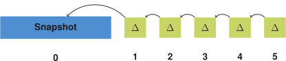

## Fundamentals
{:#fundamentals}

In this section, we introduce some fundamental concepts
that are required in our storage approach and its accompanying querying algorithms.
We discuss a hybrid IC/CB/TB storage approach,
the reason for using multiple indexes,
having local change metadata,
and methods for providing addition and deletion counts.

### Snapshot and Delta Chain
{:#snapshot-delta-chain}

As mention before in , we can distinguish individual copies (IC),
change-based (CB) or timestamp-based storage strategies in RDF archiving solutions.
While IC is optimal for querying specific version, it introduces a lot of storage overhead when there is are redundancies between each version.
On the other hand, CB is good for querying differences between versions, but is less efficient for querying specific versions as it requires
reconstructing versions based on a complete delta chain.
In this section, we discuss the hybrid IC/CB approach that our approach is based on.

[TailR](cite:cites tailr) is also hybrid IC/CB approach, in which delta chain lengths are limited
to reduce the effort of reconstructing arbitrary versions in long chains.
This is done by starting each chain with a fully materialized snapshot, followed by deltas, as shown in .
When the chain becomes too long, or other conditions are fulfilled, the chain stops
and a new fully materialized snapshot is created for the next version.

<figure id="regular-delta-chain">

<figcaption markdown="block">
Delta chain in which deltas are relative to the previous delta, as is done in [TailR](cite:cites tailr).
</figcaption>
</figure>

Results show that this is an effective way of [reducing version reconstruction times](cite:cites tailr),
but within the delta chain, an increase in version reconstruction times can still be observed.
In order to avoid these increasing reconstruction times,
we modify the delta chain structure slightly to make these times constant _independent_ of version.
We do this by instead of making deltas relative to each preceding delta,
we make them relative to the closest preceding snapshot in the chain, as shown in .
This allows version reconstruction to require only at most one delta and one snapshot for any version.
While this does increase possible redundancies within delta chains, this can easily be compressed away,
which we discuss in .

<figure id="alternative-delta-chain">

<figcaption markdown="block">
Delta chain in which deltas are relative to the snapshot at the start of the chain, as part of our approach.
</figcaption>
</figure>

### Multiple Indexes

Our storage approach consists of five different indexes are used for storing the additions and deletions
in different triple component orders, namely: SPO, SOP, PSO, POS and OSP.
The reason for five indexes instead of all six possible component orders,
as is typically done in [other approaches](cite:cites rdf3x,hexastore),
is because we only aim to evaluate all triple pattern queries efficiently without having to go over the whole index.
Other approaches are typically also interested in the final triple order for more efficient joining of streams.
If this would be needed, a sixth `POS` index could optionally be added.

The five indexes that were mentioned are sufficient for optimally reducing the iteration scope of the lookup tree for any triple pattern.
That is because for each possible triple pattern,
there exists an index at which the first triple component can be located in logarithmic time,
and the terminating element of the result stream can be identified without necessarily having to go to the last value of the tree.

The optimal index can always be identified by reordering the triple components of the incoming triple pattern
in such a way that all variable components come after the materialized components, while ensuring the SPO order within these two groups.
After that, the index that corresponds to the given triple component order can be used.
As an `OPS` index is not required, triple components for this can be reordered to `POS` without a loss of expressivity.
 shows an overview of which triple patterns can be mapped to which index.

For example, for an `S?O` query, the components are reordered to `SO?`, which corresponds to the `SOP` index.
In this case, the first `SO?` triple can be found in logarithmic time.
From the moment a triple is found where the object is larger than `O`,
we can terminate the stream because no new matching triples will be found.

<figure id="triple-pattern-index-mapping" class="table" markdown="1">

| Triple pattern | Index |
| -------------- |-------|
| S P O          | SPO   |
| S P ?          | SPO   |
| S ? O          | SOP   |
| S ? ?          | SPO   |
| ? P O          | POS   |
| ? P ?          | PSO   |
| ? ? O          | OSP   |
| ? ? ?          | SPO   |

<figcaption markdown="block">
Overview of which triple patterns can be queried inside which index to optimally reduce the iteration scope.
</figcaption>
</figure>

### Local Changes

When materializing versions by combining a delta with its snapshot,
it is important to know whether or not the delta element is relative to the snapshot or a previous delta.
Because a triple that for example was deleted in version 1, but re-added in version 2
is cancelled out when materializing against version 2.

One way of doing this is by checking both the addition and deletion trees for a given triple and version,
and determining the element with the smallest version.
All elements with version larger than this smallest version will be local changes.

An alternative approach would be to precalculate this information
and store it on each value, as is done in our [storage approach](#delta-compression).

The first approach always requires lookups in both trees,
even if only the additions or deletions are queried.
On the other hand, it requires less storage space,
because storage of the local changes requires the storage of one additional flag per triple per version.

### Addition and Deletion counts

Parts of the following querying algorithm depend on efficiently counting
the number of additions or deletions in a delta.
The naive way of doing this would be to simply iterate over all triples in a delta,
and counting all those matching the triple pattern and version.
This has a linear time complexity, so this will not perform well for large stores.
We propose two different approaches for enabling efficient addition and deletion counting in deltas.

For additions, we propose to store an additional mapping from triple pattern and version to number of additions.
This mapping must be calculated during ingestion time, so that counts during lookup time for any triple pattern
at any version can be derived in constant time.
For many triples and versions, the number of possible triple patterns can become very large,
which can result in a large mapping store.
To cope with this, we propose to only store the elements where their counts are larger than a certain threshold.
Elements that are not stored will have to be counted during lookup time.
This is however not a problem for reasonably low thresholds,
because as mentioned in ,
we can efficiently limit the iteration scope in our indexes,
so that triple patterns for which only a limited number of matches exist,
iteration, and therefore the counts, can happen efficiently.
The count treshold introduces a trade-off between the storage requirements and the required triple counting during lookups.

{:.todo}
Mention this addition count data in the storage section

As mentioned in , each deletion is annotated with its relative position in the deletions for that version.
We can exploit this information to perform deletion counting for any triple pattern and version.
This can be done by looking up the largest possible triple for the given triple pattern in the deletions tree,
which can be done in logarithmic time.
If this doesn't result in a match, we follow the backward link to the element before that one in the tree.
In this value, the position of the deletion in all deletions for the given value is available.
Because we have queried the largest possible triple for that triple pattern in the given version,
this will be the last deletion in the list, so its position corresponds to the total number of deletions in that case.