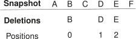

## Querying
{:#querying}

In this section, we introduce algorithms for performing VM, DM and VQ triple pattern queries
based on the storage structure introduced in [](#storage).
Before that, we introduce some fundamental concepts that are shared in all these algorithms.
Each of these querying algorithms is based on result streams, enabling efficient offsets and limits.
Furthermore, [querying algorithms](cite:cites ldf) typically use estimated counts for triple patterns
in their optimizer algorithms for determine the order of triple patterns evaluation.
In order to support this, we provide corresponding count estimation queries.

{:.todo}
Move following fundamentals section before storage section?
So the storage section doesn't have to say things like "as will be explained later...".

### Fundamentals
{:#fundamentals}

In this section, we introduce some fundamental concepts
that are required for the following querying algorithms.
We discuss the reason for using multiple indexes,
having local change metadata,
and methods for providing addition and deletion counts.

#### Multiple Indexes

As mentioned in [](#delta-compression) five different indexes are used for storing the additions and deletions
in different triple component orders, namely: SPO, SOP, PSO, POS and OSP.
The reason for five indexes instead of all six possible component orders,
as is typically done in [other approaches](cite:cites rdf3x,hexastore),
is because we only aim to evaluate all triple pattern queries efficiently without having to go over the whole index.
Other approaches are typically also interested in the final triple order for more efficient joining of streams.
If this would be needed, a sixth `POS` index could optionally be added.

The five indexes that were mentioned are sufficient for optimally reducing the iteration scope of the lookup tree for any triple pattern.
That is because for each possible triple pattern,
there exists an index at which the first triple component can be located in logarithmic time,
and the terminating element of the result stream can be identified without necessarily having to go to the last value of the tree.

The optimal index can always be identified by reordering the triple components of the incoming triple pattern
in such a way that all variable components come after the materialized components, while ensuring the SPO order within these two groups.
After that, the index that corresponds to the given triple component order can be used.
As an `OPS` index is not required, triple components for this can be reordered to `POS` without a loss of expressivity.
[](#triple-pattern-index-mapping) shows an overview of which triple patterns can be mapped to which index.

For example, for an `S?O` query, the components are reordered to `SO?`, which corresponds to the `SOP` index.
In this case, the first `SO?` triple can be found in logarithmic time.
From the moment a triple is found where the object is larger than `O`,
we can terminate the stream because no new matching triples will be found.

<figure id="triple-pattern-index-mapping" class="table" markdown="1">

| Triple pattern | Index |
| -------------- |-------|
| S P O          | SPO   |
| S P ?          | SPO   |
| S ? O          | SOP   |
| S ? ?          | SPO   |
| ? P O          | POS   |
| ? P ?          | PSO   |
| ? ? O          | OSP   |
| ? ? ?          | SPO   |


<figcaption markdown="block">
Overview of which triple patterns can be queried inside which index to optimally reduce the iteration scope.
</figcaption>
</figure>

#### Local Changes

When materializing versions by combining a delta with its snapshot,
it is important to know whether or not the delta element is relative to the snapshot or a previous delta.
Because a triple that for example was deleted in version 1, but re-added in version 2
is cancelled out when materializing against version 2.

One way of doing this is by checking both the addition and deletion trees for a given triple and version,
and determining the element with the smallest version.
All elements with version larger than this smallest version will be local changes.

An alternative approach would be to precalculate this information
and store it on each value, as is done in our [storage approach](#delta-compression).

The first approach always requires lookups in both trees,
even if only the additions or deletions are queried.
On the other hand, it requires less storage space,
because storage of the local changes requires the storage of one additional flag per triple per version.

#### Addition and Deletion counts

Parts of the following querying algorithm depend on efficiently counting
the number of additions or deletions in a delta.
The naive way of doing this would be to simply iterate over all triples in a delta,
and counting all those matching the triple pattern and version.
This has a linear time complexity, so this will not perform well for large stores.
We propose two different approaches for enabling efficient addition and deletion counting in deltas.

For additions, we propose to store an additional mapping from triple pattern and version to number of additions.
This mapping must be calculated during ingestion time, so that counts during lookup time for any triple pattern
at any version can be derived in constant time.
For many triples and versions, the number of possible triple patterns can become very large,
which can result in a large mapping store.
To cope with this, we propose to only store the elements where their counts are larger than a certain threshold.
Elements that are not stored will have to be counted during lookup time.
This is however not a problem for reasonably low thresholds,
because as mentioned in [](#fundamentals),
we can efficiently limit the iteration scope in our indexes,
so that triple patterns for which only a limited number of matches exist,
iteration, and therefore the counts, can happen efficiently.
The count treshold introduces a trade-off between the storage requirements and the required triple counting during lookups.

{:.todo}
Mention this addition count data in the storage section

As mentioned in [](#delta-compression), each deletion is annotated with its relative position in the deletions for that version.
We can exploit this information to perform deletion counting for any triple pattern and version.
This can be done by looking up the largest possible triple for the given triple pattern in the deletions tree,
which can be done in logarithmic time.
If this doesn't result in a match, we follow the backward link to the element before that one in the tree.
In this value, the position of the deletion in all deletions for the given value is available.
Because we have queried the largest possible triple for that triple pattern in the given version,
this will be the last deletion in the list, so its position corresponds to the total number of deletions in that case.

### Version Materialization

#### Query

[](#algorithm-querying-vm) introduces an algorithm for VM triple pattern queries based on our storage structure.
It starts by determining the snapshot on which the given version is based on.
After that, this snapshot is queried for the given triple pattern and offset.
If the given version is equal to the snapshot version, the snapshot iterator can be returned directly.
In all other cases, this snapshot offset is only an estimation,
and the actual snapshot offset can be larger if deletions were introduced before the actual offset.
Because of that, we enter a loop that will converge to the actual snapshot offset.
This loop starts by determining the triple at the current offset position in the snapshot.
We then query the deletions tree with for the given triple pattern and version,
and use the snapshot triple as offset.
This triple-based offset is done by navigating through the tree to the smallest triple before or equal to the offset triple.
If the query is not empty and the iterator has not yet ended,
then we use the deletion's position for the current triple pattern as new snapshot offset.
If the query is not empty and the iterator has ended,
we use the total number of deletions for the given triple pattern in this version as offset.
Otherwise, if the deletion tree query has no results, we use zero as new snapshot offset.
From the moment that the snapshot offset doesn't change anymore, we have converged to the correct offset.
After that, we return a simple iterator starting from that snapshot position,
which performs a sort-merge join-like operation that removes each triple from the snapshot that also appears in the deletion stream,
which can be done efficiently because of the consistent SPO-ordering.
From the moment the snapshot and deletion streams have finished,
the iterator will start emitting addition triples at the end of the stream.

<figure id="algorithm-querying-vm" class="algorithm">
````/algorithms/querying-vm.txt````
<figcaption markdown="block">
Version Materialization algorithm for triple patterns that produces a triple stream with an offset in a given version.
</figcaption>
</figure>

The reason why we can use the deletion's position in the changeset as offset in the snapshot
is because this position represents the number of deletions that came before that triple inside the snapshot given a consistent triple order.

For both the addition and deletion streams, local changes are filtered out.
That is because local changes mean that these triple are cancelled out for the given version as explained in [](#fundamentals),
so they shouldn't be returned in materialized versions.

[](#query-vm-example) shows simplified storage contents where triples are represented as a single letter,
and there is only a single snapshot and delta.
In the following paragraphs, we explain the offset convergence loop of the algorithm in function of this data for different offsets.

<figure id="query-vm-example" class="algorithm">

<figcaption markdown="block">
Simplified storage contents example where triples are represented as a single letter.
The snapshot contains six elements, and the next version contains three deletions.
Each deletion is annotated with its position.
</figcaption>
</figure>

#### Offset 0
For offset zero, the snapshot is first queried for this offset,
which results in a stream starting from `A`.
Next, the deletions are queried with offset `A`, which results in no match,
so the final snapshot stream starts from `A`.

#### Offset 1
For an offset of one, the snapshot stream initially starts from `B`.
After that, the deletions stream is offset to `B`, which results in a match.
The original offset (1), is increased with the position of `B` (0) and the constant 1,
which results in a new snapshot offset of 2.
We now apply this new snapshot offset.
As the snapshot offset has changed, we enter a second iteration of the loop.
Now, the head of the snapshot stream is `C`.
We offset the deletions stream to `C`, which again results in `B`.
As this offset results in the same snapshot offset,
we stop iterating and use the snapshot stream with offset 2 starting from `C`.

#### Offset 2
For offset 2, the snapshot stream initially starts from `C`.
After querying the deletions stream, we find `B`, with position 0.
We update the snapshot offset to 2 + 0 + 1 = 3,
which results in the snapshot stream with head `D`.
Querying the deletions stream results in `D` with position 1.
We now update the snapshot offset to 2 + 1 + 1 = 4, resulting in a stream with head `E`.
We query the deletions again, resulting in `E` with position 2.
Finally, we update the snapshot offset to 2 + 2 + 1 = 5 with stream head `F`.
Querying the deletions results in the same `E` element,
so we use this last offset in our final snapshot stream.

#### Estimated count

In order to provide an estimated count for VM triple pattern query,
we introduce a new algorithm in [](#algorithm-querying-vm-count).
This straightforward algorithm depends on the efficiency of the snapshot to provide count estimations for a given triple pattern.
Based on the snapshot count for the given triple pattern, the number of deletions for that version and triple pattern
are subtracted and the number of additions are added.

<figure id="algorithm-querying-vm-count" class="algorithm">
````/algorithms/querying-vm-count.txt````
<figcaption markdown="block">
Version Materialization count estimation algorithm for triple patterns in a given version.
</figcaption>
</figure>

#### Proof

{:.todo}
proof regular and count algo

### Delta Materialization

#### Query

{:.todo}
Write

#### Estimated count

{:.todo}
Write

#### Proof

{:.todo}
proof regular and count algo

### Version Query

#### Query

{:.todo}
Write

#### Estimated count

{:.todo}
Write

#### Proof

{:.todo}
proof regular and count algo
