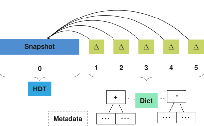

## Storage
{:#storage}

In this section, we introduce a storage approach for storing multiple versions of an RDF dataset.
We focus on the part of answering our research question on how to efficiently store and query RDF archives, as introduced in .

In order to handle VM, DM and VQ queries efficiently, our storage solution is a hybrid IC/CB/TB solution.
In summary, our approach consists of an initial dataset snapshot followed by a delta chain ([TailR](cite:cites tailr)),
where this chain is compressed in B+Trees for TB-storage ([Dydra](cite:cites dydra)).
Furthermore, we store additional metadata for convenience and improving lookup times ([HDT](cite:cites hdt)).
Triple components are encoded in a dictionary for improved compression ([HDT](cite:cites hdt))
and we provide multiple indexes for different triple component orders ([RDF-3X](cite:cites rdf3x), [Hexastore](cite:cites hexastore)).
 shows and overview of these main components, which will be explained in more detail in the following sections.
We end of this section with a description of ingestion algorithms for this storage approach.

<figure id="storage-overview">

<figcaption markdown="block">
The initial version of an RDF archive is stored as a _fully materialized snapshot_, for example using the HDT format.
Each following version is stored as a _delta_ relative to the initial snapshot.
All delta's are compressed in _addition and deletion trees_, where a _dictionary_ is used to compress triple components.
Finally, metadata about the complete archive is stored, containing information such as the total number of available versions.
</figcaption>
</figure>
