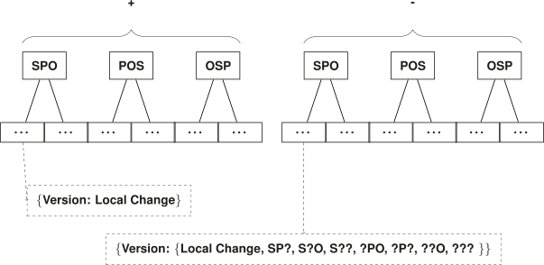

## Storage
{:#storage}

In this section, we introduce our hybrid IC/CB/TB storage approach for storing multiple versions of an RDF dataset.
 shows an overview of the main components.
Our approach consists of an initial dataset snapshot---stored in [HDT](cite:cites hdt)---followed by a delta chain (similar to [TailR](cite:cites tailr)).
The delta chain uses multiple compressed B+Trees for a TB-storage strategy (similar to [Dydra](cite:cites dydra)),
applies dictionary-encoding to triples, and
stores additional metadata to improve lookup times .
In this section, we discuss each component in more detail.
In the next section, we describe two ingestion algorithms based on this storage structure.

<figure id="storage-overview">

<figcaption markdown="block">
Overview of the main components of our hybrid IC/CB/TB storage approach.
</figcaption>
</figure>

### Snapshot storage
{:#snapshot-storage}

As mentioned before, the start of each delta chain is a fully materialized snapshot.
In order to provide sufficient efficiency for VM, DM and VQ querying with respect to all versions in the chain,
we assume the following requirements for the snapshot storage:

- Any triple pattern query _must_ be resolvable as triple streams.
- Offsets _must_ be applicable to the result stream of any triple pattern query.
- Cardinality estimation for all triple pattern queries _must_ be possible.

These requirements are needed for ensuring the efficiency of the querying algorithms that will be introduced in .
For the implementation of snapshots,
existing techniques such as [HDT](cite:cites hdt) fulfill all the requirements.
Therefore,
we do not introduce a new snapshot approach, but use HDT in our implementation.
This will be explained further in .

### Delta Chain Dictionary
{:#dictionary}

A common technique in [RDF indexes](cite:cites hdt,rdf3x,triplebit) is to use a dictionary for mapping triple components to numerical IDs.
This is done for three main reasons:
1) reduce storage space if triple components are stored multiple times;
2) reducing I/O overhead when retrieving data; and
3) simplify and optimize querying.
As our storage approach essentially stores each triple three or six times,
a dictionary can definitely reduce storage space requirements.

Each delta chain consists of two dictionaries, one for the snapshot and one for the deltas.
The snapshot dictionary consists of triple components that already existed in the snapshot.
All other triple components are present in the delta dictionary.
This dictionary is shared between the additions and deletions,
as the dictionary ignores whether or not the triple is an addition or deletion.
How this distinction is made will be explained in .
The snapshot dictionary can be optimized and sorted, as it will not change over time.
The delta dictionary is volatile, as each new version can introduce new mappings.

During triple encoding (i.e., ingestion), the snapshot dictionary will always first be probed for existence of the triple component.
If there is a match, that ID is used for storing the delta's triple component.
To identify the appropriate dictionary for triple decoding,
a reserved bit is used where `1` indicates snapshot dictionary
and `0` indicates the delta dictionary.
The text-based dictionary values can be compressed to reduce storage space further, as they are likely to contain many redundancies.

 contains example encodings of the triple components
from the example in .

<figure id="example-archive" class="table" markdown="1">

| Version | Triple                       |
|--------:|------------------------------|
| 0       | `ex:Bob foaf:name "Bobby"`   |
|||
| 1       | `ex:Alice foaf:name "Alice"` |
| 1       | `ex:Bob foaf:name "Bobby"`   |
||
| 2       | `ex:Bob foaf:name "Bob"`     |
||
| 3       | `ex:Alice foaf:name "Alice"` |
| 3       | `ex:Bob foaf:name "Bob"`     |

<figcaption markdown="block">
Example of a small RDF archive with 4 versions.
We assume that the following URI prefixes: `ex: http://example.org`, `foaf: http://xmlns.com/foaf/0.1/`
</figcaption>
</figure>

<figure id="example-delta-storage-dict" class="table" markdown="1">

| Triple Component | ID   |
|------------------|-----:|
| `ex:Bob`         | `S0` |
| `foaf:name`      | `S1` |
| `"Bobby"`        | `S2` |
| `ex:Alice`       | `D0` |
| `"Alice"`        | `D1` |
| `"Bob"`          | `D2` |

<figcaption markdown="block">
Example encoding of several triple components.
Instead of the reserved bit, IDs prefixed with `S` belong to the snapshot dictionary
and those prefixed with `D` belong to the delta dictionary.
</figcaption>
</figure>

### Delta Storage
{:#delta-storage}

In order to cope with the newly introduced redundancies in our delta chain structure,
we introduce a delta storage method similar to the TB storage strategy,
which is able to compress redundancies within consecutive deltas.
In contrast to a regular TB approach, which stores plain timestamped triples,
we store timestamped triples annotated with a flag for addition or deletion.
An overview of this storage technique is shown in ,
which will be explained in detail hereafter.

<figure id="delta-storage-overview">

<figcaption markdown="block">
Overview of the components for storing a delta chain.
The value structure for the addition and deletion trees are indicated with the dashed nodes.
</figcaption>
</figure>

The additions and deletions of deltas require different metadata in our querying algorithms,
which will be explained in .
Additions and deletions are respectively stored in separate stores,
which hold all additions and deletions from the complete delta chain.
Each store uses B+Tree data structures,
where a key corresponds to a triple and the value contains version information.
The version information consists of a mapping from version to a local change flag and,
in case of deletions, also the relative position of the triple inside the delta.
Even though triples can exist in multiple deltas in the same chain,
they will only be stored once.
Each addition and deletion store uses three trees with a different triple component order (SPO, POS and OSP),
which is sufficient for efficiently resolving any triple pattern (as discussed in ).

The local change flag indicates whether or not the triple is a _local change_, which, as mentioned in , further improves query evaluation time.
A triple is a local change in a certain version in respectively the addition/deletion tree
if it was already respectively removed/added in an earlier version.
This local change information helps the querying algorithm to determine when to ignore a triple or not.

The relative position of each triple inside the delta to the deletion trees speeds up the process
of patching a snapshot's triple pattern subset for any given offset.
In fact, seven relative positions are stored for each triple: one for each possible triple pattern (`SP?`, `S?O`, `S??`, `?PO`, `?P?`, `??O`, `???`),
except for `SPO` since this position will always be 0 as each triple is stored only once.
This position information serves two purposes:
1) it allows the querying algorithm to exploit offset capabilities of the snapshot store
to resolve offsets for any triple pattern against any version;
and 2) it allows deletion counts for any triple pattern and version to be determined efficiently.

The use of the relative position and the local change flag will be further explained in .

 and  respectively represent
the addition and deletion tree contents when the triples from the example in  are stored.
The local change flag is enabled for `D0;S1;D1` in the deletions tree for version 2, as it was previously added in version 1.
The relative positions in the deletion tree for `S0;S1;S2` is not the same for versions 2 and 3,
because in version 2, the triple `D0;S1;D1` also exists as a deletion, and when sorted, this comes before `S0;S1;S2` for triple patterns `?P?` and `???`.

<figure id="example-delta-storage-additions" class="table" markdown="1">

| T          | V | L |
|------------|--:|---|
| `D0;S1;D1` | 1 | F |
|            | 3 | F |
| `S0;S1;D2` | 2 | F |

<figcaption markdown="block">
Addition tree contents based on the example from  using the dictionary encoding from .
Column `T` represents the keys of the tree, which contains triples based on the encoded triple components.
The remaining columns represent the values, i.e., a mapping from version (`V`) to the local change flag (`L`).
</figcaption>
</figure>

<figure id="example-delta-storage-deletions" class="table" markdown="1">

| T          | V | L | `SP?` | `S?O` | `S??` | `?PO` | `?P?` | `??O` | `???` |
|------------|--:|---|------:|------:|------:|------:|------:|------:|------:|
| `D0;S1;D1` | 2 | T | 0     | 0     | 0     | 0     | 0     | 0     | 0     |
| `S0;S1;S2` | 2 | F | 0     | 0     | 0     | 0     | 1     | 0     | 1     |
|            | 3 | F | 0     | 0     | 0     | 0     | 0     | 0     | 0     |

<figcaption markdown="block">
Deletion tree contents based on the example from  using the dictionary encoding from .
Column `T` represents the keys of the tree, which contains triples based on the encoded triple components.
The remaining columns represent the values, i.e., a mapping from version (`V`) to the local change flag (`L`)
and relative positions for all essential triple patterns.
</figcaption>
</figure>

### Addition Counts
{:#addition-counts}

As mentioned before in ,
in order to make the counting of matching addition triples for any triple pattern for any version more efficient,
we propose to store an additional mapping from triple pattern and version to the number of matching additions.
Furthermore, for being able to retrieve the total number of additions across all versions,
we also propose to store this value for all triple patterns.
This mapping must be calculated during ingestion time, so that counts during lookup time for any triple pattern
at any version can be derived in constant time.
For many triples and versions, the number of possible triple patterns can become very large,
which can result in a large mapping store.
To cope with this, we propose to only store the elements where their counts are larger than a certain threshold.
Elements that are not stored will have to be counted during lookup time.
This is however not a problem for reasonably low thresholds,
because the iteration scope in our indexes can be limited efficiently, as mentioned in .
Thus, for triple patterns for which only a limited number of matches exist,
iteration, and therefore the counts, can happen efficiently.
The count threshold introduces a trade-off between the storage requirements and the required triple counting during lookups.

### Deletion Counts
{:#deletion-counts}

As mentioned in , each deletion is annotated with its relative position in all deletions for that version.
This position is exploited to perform deletion counting for any triple pattern and version.
We look up the largest possible triple (sorted alphabetically) for the given triple pattern in the deletions tree,
which can be done in logarithmic time by navigating in the tree to the largest possible match for the given triple pattern.
If this does not result in a match for the triple pattern, no matches exist for the given triple pattern, and the count is zero.
Otherwise, we take one plus the relative position of the matched deletion for the given triple pattern.
Because we have queried the largest possible triple for that triple pattern in the given version,
this will be the last deletion in the list, so this position corresponds to the total number of deletions in that case.

For example, when we want to determine the deletion count for `? foaf:name ?` (encoded: `? S1 ?`) in version 2
using the deletion tree contents from ,
we will find `S0;S1;S2` as largest triple in version 2.
This triple has relative position `1` for `?P?`, so the total deletion count is `2` for this pattern.
This is correct, as we have indeed two triples matching this pattern, namely `D0;S1;D1` and `S0;S1;S2`.

### Metadata
{:#metadata}

Querying algorithms have to be able to detect the total number of versions across all delta chains.
Therefore,
we must store metadata regarding the delta chain version ranges.
Assuming that version identifiers are numerical, a mapping can be maintained from version ID to delta chain.
Additionally, a counter of the total number of versions must be maintained for when the last version must be identified.
