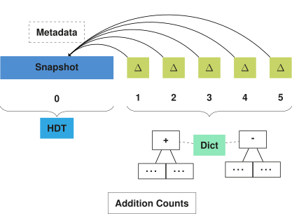

## Storage
{:#storage}

In this section, we introduce a storage approach for storing multiple versions of an RDF dataset.
We focus on the part of answering our research question on how to efficiently store and query RDF archives, as introduced in .

In order to handle VM, DM and VQ queries efficiently, our storage solution is a hybrid IC/CB/TB triple store.
In summary, our approach consists of an initial dataset snapshot followed by a delta chain ([TailR](cite:cites tailr)),
where this chain is compressed in B+Trees for TB-storage ([Dydra](cite:cites dydra)).
Furthermore, we store additional metadata for convenience and improving lookup times ([HDT](cite:cites hdt)).
Triple components are encoded in a dictionary for improved compression ([HDT](cite:cites hdt))
and we provide multiple indexes for different triple component orders ([RDF-3X](cite:cites rdf3x), [Hexastore](cite:cites hexastore)).
 shows and overview of these main components, which will be explained in more detail in the following sections.
We end of this section with a description of ingestion algorithms for this storage approach.

<figure id="storage-overview">

<figcaption markdown="block">
The initial version of an RDF archive is stored as a _fully materialized snapshot_, for example using the HDT format.
Each following version is stored as a _delta_ relative to the initial snapshot.
All delta's are compressed in _addition and deletion trees_, where a _dictionary_ is used to compress triple components.
Finally, metadata about the complete archive is stored, containing information such as the total number of available versions.
</figcaption>
</figure>

{:.todo}
Snapshot requirements:
* triple pattern queries
* offsets
* dictionary

### Snapshot and Delta Chain
{:#snapshot-delta-chain}

As mention before in , we can distinguish individual copies (IC),
change-based (CB) or timestamp-based storage strategies in RDF archiving solutions.
While IC is optimal for querying specific version, it introduces a lot of storage overhead when there is are redundancies between each version.
On the other hand, CB is good for querying differences between versions, but is less efficient for querying specific versions as it requires
reconstructing versions based on a complete delta chain.
In this section, we discuss the hybrid IC/CB approach that our approach is based on.

[TailR](cite:cites tailr) is also hybrid IC/CB approach, in which delta chain lengths are limited
to reduce the effort of reconstructing arbitrary versions in long chains.
This is done by starting each chain with a fully materialized snapshot, followed by deltas, as shown in .
When the chain becomes too long, or other conditions are fulfilled, the chain stops
and a new fully materialized snapshot is created for the next version.

<figure id="regular-delta-chain">

<figcaption markdown="block">
Delta chain in which deltas are relative to the previous delta, as is done in [TailR](cite:cites tailr).
</figcaption>
</figure>

Results show that this is an effective way of [reducing version reconstruction times](cite:cites tailr),
but within the delta chain, an increase in version reconstruction times can still be observed.
In order to avoid these increasing reconstruction times,
we modify the delta chain structure slightly to make these times constant _independent_ of version.
We do this by instead of making deltas relative to each preceding delta,
we make them relative to the closest preceding snapshot in the chain, as shown in .
This allows version reconstruction to require only at most one delta and one snapshot for any version.
While this does increase possible redundancies within delta chains, this can easily be compressed away,
which we discuss in .

<figure id="alternative-delta-chain">

<figcaption markdown="block">
Delta chain in which deltas are relative to the snapshot at the start of the chain, as part of our approach.
</figcaption>
</figure>

### Delta Storage
{:#delta-compression}

In order to cope with the newly introduced redundancies because of our alternative delta chain structure,
we introduce a delta storage method similar to the TB storage strategy,
which is able to compress redundancies within consecutive deltas.

The additions and deletions of deltas require different metadata in our querying algorithms,
which will be explained in .
That is why we store these in separate addition and deletion stores,
all additions and deletions from the complete delta chain are respectively stored together.
We use a tree structure (such as a B+Tree) for these addition and deletion stores,
where the keys correspond to triples, and the values correspond to version information,
which are similar to timestamps as in TB solutions.
Even though triples can exist in multiple deltas in the same chain,
they will only be stored once in the trees because their value contains information about version membership.

In order to improve the efficiency during triple pattern query evaluation,
we store the trees in different triple component orders,
similar to [RDF-3X](cite:cites rdf3x) and [Hexastore](cite:cites hexastore).
Our approach consists of five orders per addition and deletion tree: SPO, SOP, PSO, POS and OSP.
In , we will illustrate why these five indexes are sufficient for optimally resolving any triple pattern.

Furthermore, in order to further speed up query evaluation,
we add metadata to each triple indicating whether or not the triple is a _local change_.
A triple is a local change in a certain version if it was already either added or removed in an earlier version.
This local change information helps the querying algorithm to determine when to ignore a triple or not,
which will be further explained in .

Finally, in order to speed up the process of patching a snapshot's triple pattern subset for any given offset,
we add metadata about the position of each triple inside the snapshot to the deletion trees.
This position information allows the querying algorithm to exploit offset capabilities of the snapshot store
to resolve offsets for any triple pattern against any version.
This process will also be further explained in .

{:.todo}
Mention offsets already somewhere before this.

In summary, we store ten trees, five for both the additions and deletions.
The trees use triples as keys, with five different triple component orders.
The addition trees store version and local change information.
The deletion trees store the same, but additionally also relative snapshot positions.

### Delta Chain Dictionary
{:#dictionary}

A typical technique in [RDF storage solutions](cite:cites hdt,rdf3x,triplebit) is to use a dictionary for mapping triple components to numerical IDs.
This is generally done for main two reasons:
1) to reduce storage space if triple components are stored multiple times;
2) to simplify and optimize querying.
As our storage approach essentially stores each triple five or ten times,
a dictionary can definitely reduce storage space requirements.

Each delta chain consists of two dictionaries, one for the snapshot and one for the deltas.
The dictionary of the snapshot can be optimized and sorted, as it will not change over time.
The dictionary of the deltas is volatile, as each new version can introduce new mappings.

During triple encoding, the snapshot dictionary will always first be queried for existence of the triple component.
If there is a match, that ID is used for storing the delta's triple component.

For allowing the querying algorithm to identify the appropriate dictionary for triple decoding,
some form of dictionary identification must be encoded inside the ID,
which can for example be a reserved bit.

As the dictionary entries are text-based, they are likely to contain a lot of redundancies.
That is why the dictionary can be compressed to reduce storage requirements.

### Metadata
{:#metadata}

In order to allow querying algorithms to detect the total number of versions across all delta chains,
we must store metadata regarding the delta chain version ranges.
Assuming numerical version identifiers, a mapping can be maintained from version ID to delta chain.
Additionally, a total version counter must be maintain for cases when the last version must be identified.

### Ingestion
{:#ingestion}

{:.todo}
Explain both approaches (compare them later in eval)