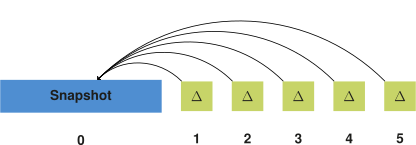

## Storage
{:#storage}

In this section, we introduce a storage approach for storing multiple versions of an RDF dataset.
We focus on the part of answering our research question on how to efficiently store and query RDF archives, as introduced in .

In order to handle VM, DM and VQ queries efficiently, our storage solution is a hybrid IC/CB/TB solution.
In summary, our approach consists of an initial dataset snapshot followed by a delta chain ([TailR](cite:cites tailr)),
where this chain is compressed in B+Trees for TB-storage ([Dydra](cite:cites dydra)).
Furthermore, we store additional metadata for convenience and improving lookup times ([HDT](cite:cites hdt)).
Triple components are encoded in a dictionary for improved compression ([HDT](cite:cites hdt))
and we provide multiple indexes for different triple component orders ([RDF-3X](cite:cites rdf3x), [Hexastore](cite:cites hexastore)).
 shows and overview of these main components, which will be explained in more detail in the following sections.
We end of this section with a description of ingestion algorithms for this storage approach.

<figure id="storage-overview">

<figcaption markdown="block">
The initial version of an RDF archive is stored as a _fully materialized snapshot_, for example using the HDT format.
Each following version is stored as a _delta_ relative to the initial snapshot.
All delta's are compressed in _addition and deletion trees_, where a _dictionary_ is used to compress triple components.
Finally, metadata about the complete archive is stored, containing information such as the total number of available versions.
</figcaption>
</figure>

### Snapshot and Delta Chain
{:#snapshot-delta-chain}

As mention before in , we can distinguish individual copies (IC),
change-based (CB) or timestamp-based storage strategies in RDF archiving solutions.
While IC is optimal for querying specific version, it introduces a lot of storage overhead when there is are redundancies between each version.
On the other hand, CB is good for querying differences between versions, but is less efficient for querying specific versions as it requires
reconstructing versions based on a complete delta chain.
In this section, we discuss the hybrid IC/CB approach that our approach is based on.

TailR is also hybrid IC/CB approach, in which delta chain lengths are limited
to reduce the effort of reconstructing arbitrary versions in long chains.
This is done by starting each chain with a fully materialized snapshot, followed by deltas, as shown in .
When the chain becomes too long, or other conditions are fulfilled, the chain stops
and a new fully materialized snapshot is created for the next version.

<figure id="regular-delta-chain">

<figcaption markdown="block">
Delta chain in which deltas are relative to the previous delta, as is done in TailR.
</figcaption>
</figure>

Results show that this is an effective way of [reducing version reconstruction times](cite:cites tailr),
but within the delta chain, an increase in version reconstruction times can still be observed.
In order to avoid these increasing reconstruction times,
we modify the delta chain structure slightly to make these times constant _independent_ of version.
We do this by instead of making deltas relative to each preceding delta,
we make them relative to the closest preceding snapshot in the chain, as shown in .
This allows version reconstruction to require only at most one delta and one snapshot for any version.
While this does increase possible redundancies within delta chains, this can easily be compressed away,
which we discuss in .

<figure id="alternative-delta-chain">

<figcaption markdown="block">
Delta chain in which deltas are relative to the snapshot at the start of the chain, as part of our approach.
</figcaption>
</figure>

### Delta Storage
{:#delta-compression}

{:.todo}
Write

### Dictionary
{:#dictionary}

{:.todo}
Write

### Metadata
{:#metadata}

{:.todo}
Write

### Ingestion
{:#ingestion}

{:.todo}
Explain both approaches (compare them later in eval)